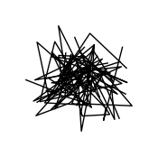
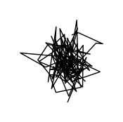
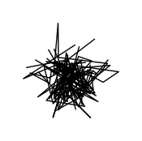
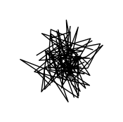
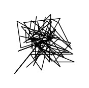
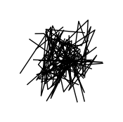
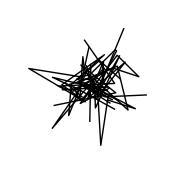
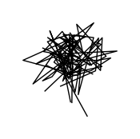

# ChiroDiff: Modelling chirographic data with Diffusion Models
### Accepted at International Conference on Learning Representation (ICLR) 2023

Authors: [Ayan Das](https://ayandas.me/), [Yongxin Yang](https://yang.ac/), [Timothy Hospedales](https://homepages.inf.ed.ac.uk/thospeda/), [Tao Xiang](http://personal.ee.surrey.ac.uk/Personal/T.Xiang/index.html), [Yi-Zhe Song](http://personal.ee.surrey.ac.uk/Personal/Y.Song/)

<p align="center">
    
    <br />
    
    
</p>


<h3>
<p align="center">
    [<a href="https://openreview.net/pdf?id=1ROAstc9jv">OpenReview</a>], [<a href="https://arxiv.org/abs/2304.03785">arXiv</a>] & [<a href="https://ayandas.me/chirodiff">Project Page</a>]
</p>
</h3>

> **Abstract:** Generative modelling over continuous-time geometric constructs, a.k.a  such as handwriting, sketches, drawings etc., have been accomplished through autoregressive distributions. Such strictly-ordered discrete factorization however falls short of capturing key properties of chirographic data -- it fails to build holistic understanding of the temporal concept due to one-way visibility (causality). Consequently, temporal data has been modelled as discrete token sequences of fixed sampling rate instead of capturing the true underlying concept. In this paper, we introduce a powerful model-class namely "Denoising Diffusion Probabilistic Models" or DDPMs for chirographic data that specifically addresses these flaws. Our model named "ChiroDiff", being non-autoregressive, learns to capture holistic concepts and therefore remains resilient to higher temporal sampling rate up to a good extent. Moreover, we show that many important downstream utilities (e.g. conditional sampling, creative mixing) can be flexibly implemented using ChiroDiff. We further show some unique use-cases like stochastic vectorization, de-noising/healing, abstraction are also possible with this model-class. We perform quantitative and qualitative evaluation of our framework on relevant datasets and found it to be better or on par with competing approaches.
  
---

## Running the code

The instructions below guide you regarding running the codes in this repository.

#### Table of contents:
1. Environment and libraries
2. Data preparation
3. Training
4. Inference

### Environment & Libraries

Running the code may require some libraries slightly outdated. The full list is provided as a `requirements.txt` in this repo. Please create a virtual environment with `conda` or `venv` and run

~~~bash
(myenv) $ pip install -r requirements.txt
~~~

### Data preparation

You can feed the data in one of two ways -- "unpacked" and "unpacked and preprocessed". The first one will dynamically load data from individual files, whereas the later packs preprocessed input into one single `.npz` file -- increasing training speed.

- To "unpack" the QuickDraw dataset, [download](https://console.cloud.google.com/storage/browser/quickdraw_dataset/full/raw?pageState=(%22StorageObjectListTable%22:(%22f%22:%22%255B%255D%22))&prefix=&forceOnObjectsSortingFiltering=true) the `.ndjson` file for any category(s) you like and save it in a folder `/path/to/all/ndjsons/`. Then use the utility `data/unpack_ndjson.py` provided to unpack them
    ~~~bash
    (myenv) $ python data/unpack_ndjson.py --data_folder /path/to/all/ndjsons/ --category cat --out_folder /the/output/dir/ --max_sketches 100000
    # produced a folder /the/output/dir/cat/ with all samples (unpacked)
    ~~~
    You may use this folder just as is, however, it might be slow for training. We recommend you pack them with all preprocessing into one `.npz` file using the `data/qd.py` script
    ~~~bash
    (myenv) $ python data/qd.py /the/output/dir/cat threeseqdel
    # produces a file /the/output/dir/cat_threeseqdel.npz
    ~~~
    The `threeseqdel` is one of many modes of training -- more on this later. The produced `.npz` file can be now used for training. Please see the `if __name__ == '__main__'` section of `data/qd.py` for preprocessing options.

- For `VMNIST` and `KanjiVG` datasets, the unpacked files are readily available [here](https://drive.google.com/drive/folders/1C6euR9HPLdL_nubqLk8wEao96KRNZJl_?usp=sharing) for download. Follow the same steps above to process and pack them into `.npz`.


### Training & Sampling

There are multiple training "modes" corresponding to the model type (unconditional, sequence conditioned etc).

```bash
threeseqdel # unconditional model with delta (velocity) sequence
threeseqdel_pointcloudcond # conditioned on pointcloud representation
threeseqdel_classcond # conditioned on class
threeseqdel_threeseqdelcond # conditioned on self

threeseqabs # unconditional model with absolute (position) sequence
threeseqabs_pointcloudcond # conditioned on pointcloud representation
threeseqabs_classcond # conditioned on class
threeseqabs_threeseqabscond # conditioned on self
```

- Use one of the modes in `--model.repr` and `--data.init_args.repr` command line argument.
- Use the processed data file (i.e. `*.npz`) with `--data.init_args.root_dir ...`. You may also use un-processed data folder here.

**Note:** For simplicity, we provided a `config.yml` file where all possible command line option can be altered. Then run the main script as

```bash
(myenv) $ python main.py fit --config config.yml --model.arch_layer 3 --model.noise_T 100 ...
```

You will also need `wandb` for logging. Please use your own account and fill the correct values of `--trainer.logger.init_args.{entity, project}` in the `config.yml` file. You may also remove the `wandb` logger entirely and replace with another logger of your choice. In that case, you might have to modify few lines of codes.

While training, the script will save the full config of the run, a "best model" and a "last model". Once trained, use the saved model (saved every 300 epoch) and full configuration using the `--ckpt_path` and `--config` argument like so

```bash
(myenv) $ python main.py test --config ./logs/test-run/config.yaml --ckpt_path ./logs/test-run/.../checkpoints/model.ckpt --limit_test_batches 1
```

By default, the testing phase will write some vizualization helpful for inspection. For example, a generation results and a diffusion process vizualization. Test time option have `--test_` prefixes. Feel free to play around with them.

```bash
(myenv) $ python main.py test --config ... --ckpt_path ... \
            --test_sampling_algo ddpm \
            --test_variance_strength 0.75 \
            --text_viz_process backward \
            --test_save_everything 1
```
---

You can site the paper as

```bibtex
@inproceedings{das2023chirodiff,
    title={ChiroDiff: Modelling chirographic data with Diffusion Models},
    author={Ayan Das and Yongxin Yang and Timothy Hospedales and Tao Xiang and Yi-Zhe Song},
    booktitle={The Eleventh International Conference on Learning Representations },
    year={2023},
    url={https://openreview.net/forum?id=1ROAstc9jv}
}
```

---

**Notes:**

1. This repository is a part of our research codebase and may therefore contain codes/options that are not part of the paper.
2. This repo may also contain some implmenetation details that has been upgraded since the submission of the paper. 
3. The README is still incomplete and I will add more info when I get time. You may try different settings yourself.
4. The default parameters might not match the ones in the paper. Feel free to change play with them.

